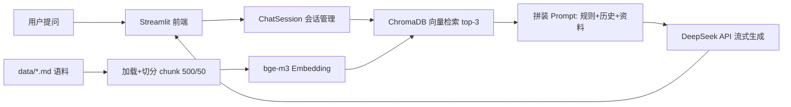

# MechKB — 机械工艺知识库 RAG 问答助手

> 让机械工程师用自然语言查工艺知识，回答附原文出处。

[]()
[]()
[]()

**在线 Demo**：https://mechkb-wzd.streamlit.app （Streamlit Community Cloud 部署，闲置后首次访问需等待约 30 秒唤醒）

## 为什么做这个

工厂里查工艺知识靠翻手册目录、靠关键词搜索，无法直接用自然语言提问，新人上手慢。
MechKB 用 RAG（检索增强生成）让工程师直接提问："45号钢怎么做调质？"——系统检索知识库后生成回答，并标注答案依据来自哪份文档，**库外问题如实拒答**。

## 功能特性

- 🔍 **检索问答 + 引用溯源**：每个回答标注依据文档，可展开查看检索到的原文片段
- 🛡️ **幻觉抑制**：知识库未覆盖的问题明确回答"未提及"，不编造
- 💬 **多轮对话**：支持追问（"它和正火有什么区别？"），会话历史持久化到本地
- ⚡ **流式输出**：打字机效果，首字响应从 3-5s 降至 1s 内
- 📤 **知识库热更新**：网页端上传 Markdown 文档，一键重建向量库
- 📊 **自动化评测**：20 题评测集（含 3 道拒答题），一键测检索命中率

## 技术栈

| 层 | 选型 | 理由 |
|---|---|---|
| LLM | DeepSeek API（OpenAI 兼容协议） | 中文好、成本低；base_url 一行可换供应商 |
| Embedding | bge-m3（硅基流动，免费） | 中文语义检索效果优于 OpenAI ada |
| 向量库 | ChromaDB（本地持久化） | 零运维，适合中小规模知识库 |
| 框架 | LangChain（加载/切分/向量库集成） | 生态成熟；LLM 调用层自封装 |
| 前端 | Streamlit | Python 全栈，快速验证产品形态 |
| 部署 | Docker / Hugging Face Spaces | 一键复现 |

## 架构



## 工程细节

- **LLM 调用层自封装**：有限重试（仅临时错误）+ 指数退避（1s/2s/4s）+ 超时控制 + 流式/普通双模式，不依赖 SDK 默认重试
- **多轮对话只按当前问题检索**：避免追问时检索漂移
- **重建向量库删集合不删文件夹**：规避 Windows 文件锁（WinError 32）

## 评测

20 题评测集（17 检索题 + 3 拒答题），判据：期望文档出现在检索结果 top-3。

```bash
python -m eval.run_eval          # 检索命中率评测
python -m eval.chunk_experiment  # chunk_size 三档对比实验
```

**结果**：检索命中率 17/17 = **100%**（top-3）。chunk_size 300/500/800 三档对比差异不显著（语料规模 4 篇 / 10-24 chunk），最终选 500/50 作为粒度与上下文完整性的平衡点。评测结论与数据规模强相关，语料扩充后将重跑实验。

## 快速开始

```bash
git clone https://github.com/HAN-wzd/mechkb.git
cd mechkb
python -m venv .venv && .venv\Scripts\activate
pip install -r requirements.txt

# 配置 API Key（参照 .env.example）
# DEEPSEEK_API_KEY=...  EMBEDDING_API_KEY=...

python -m core.vectorstore       # 首次：构建向量库（约 1-3 分钟）
python -m streamlit run app.py   # 启动 Web 界面
```

## Docker

```bash
docker build -t mechkb .
docker run -p 8501:8501 --env-file .env mechkb
```

## 项目结构

```
mechkb/
├── app.py               # Streamlit 前端（流式对话/引用面板/文档上传）
├── core/
│   ├── llm.py           # LLM 封装：重试/退避/超时/流式
│   ├── loader.py        # 文档加载（metadata.source 溯源）
│   ├── splitter.py      # 递归切分（中文 separators）
│   ├── vectorstore.py   # Embedding + ChromaDB 入库与检索
│   └── chain.py         # RAG 问答链 + 多轮会话（JSON 持久化）
├── eval/
│   ├── questions.json   # 20 题评测集（含拒答题）
│   ├── run_eval.py      # 命中率评测
│   └── chunk_experiment.py  # 切分参数对比实验
├── data/                # 机械工艺语料（金属材料/加工工艺/设备维护）
└── Dockerfile
```

## 开发者

吴振东 — 机械设计制造及其自动化专业（2026 届），两段制造业产线实习经历，正在转向 AI 应用开发。语料与评测题设计来自真实工厂场景。

开发日志（博客）：[链接待补]